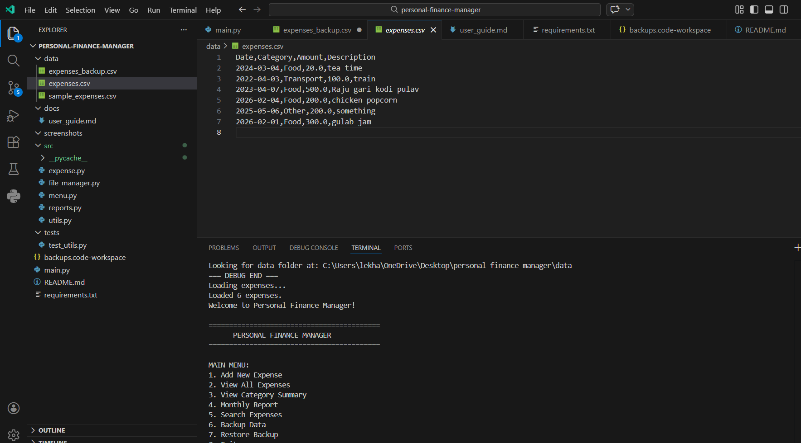
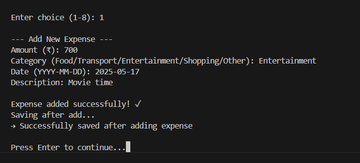
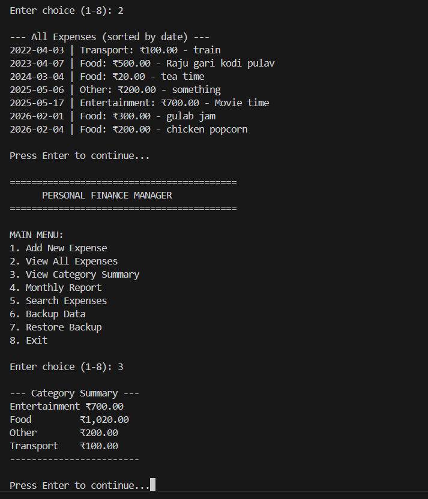
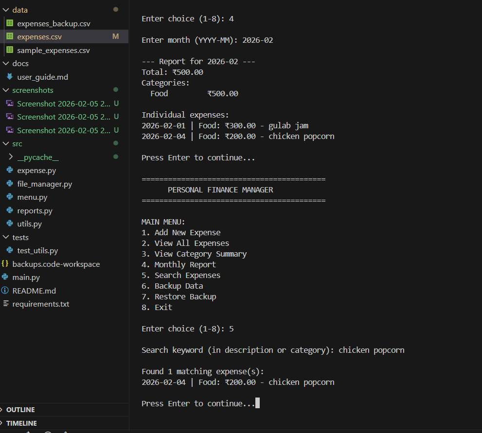
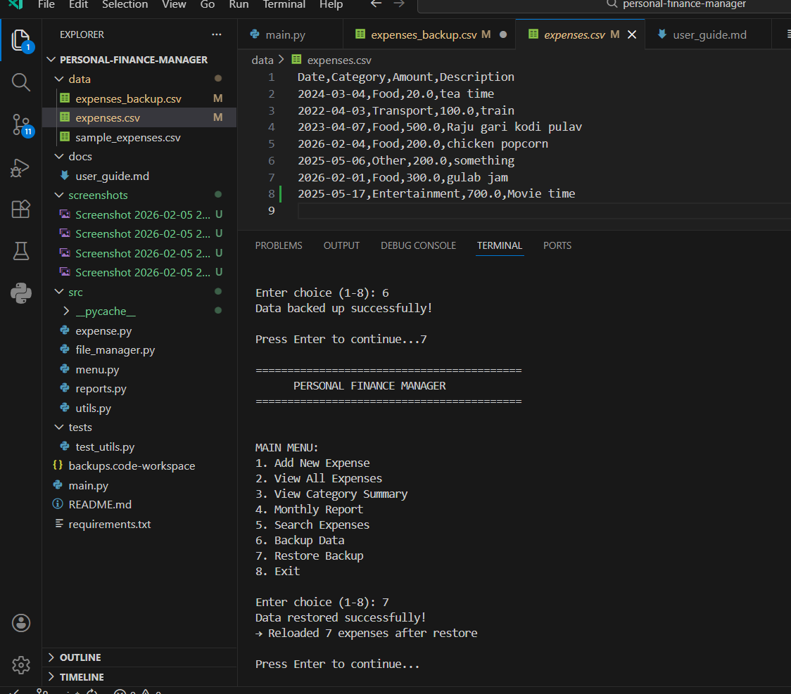
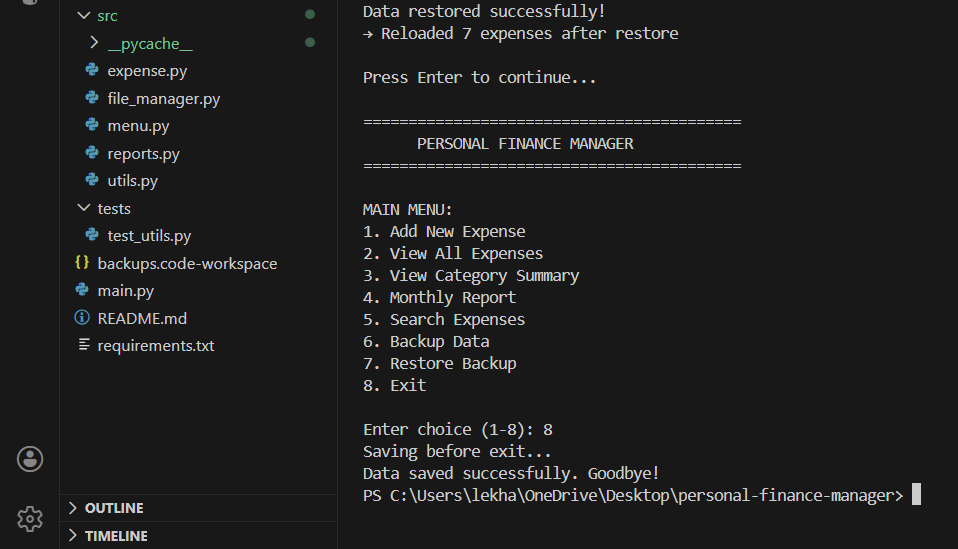

# Personal Finance Manager

A complete command-line **Python expense tracker** built with OOP principles, modular structure, CSV persistence, input validation, error handling, and a user-friendly menu.

### Features
- Add expenses (amount, category, date, description) with automatic validation
- View all expenses sorted by date
- Category-wise spending summary and averages
- Monthly reports with totals and breakdowns
- Keyword search in descriptions/categories
- Data backup and restore
- Persistent storage in `data/expenses.csv` (auto-saved on add/exit)
- No external libraries required

### Technologies Used
- Python 3 (standard library only: csv, datetime, os, shutil, collections, sys)
- Modular design: separate files for classes, file handling, UI, reports, utils

### How to Run
1. Open the project folder in VS Code
2. Open the integrated terminal (Ctrl + `)
3. Run:
   ```bash
   python main.py


## Screenshots

### Main Menu


### Adding an Expense


### View All Expenses / Category Summary


### Monthly Report


### CSV File with Data


### Another View (optional)

## Screenshots
### Main Menu


### Adding an Expense


### View All Expenses / Category Summary


### Monthly Report


### CSV File with Data


### Another View
